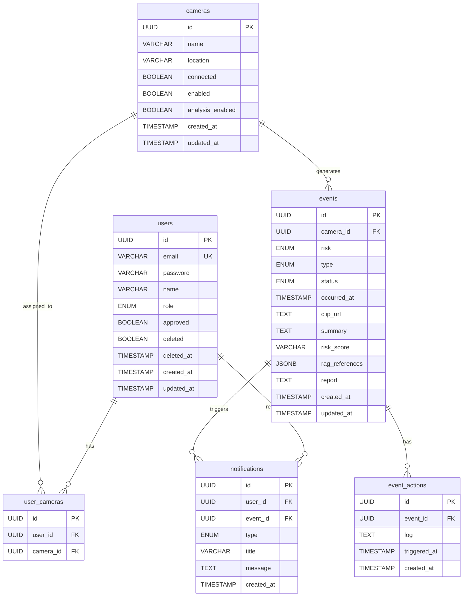

# AEGIS Backend

> Agent 기반 안전 모니터링 시스템 - 백엔드

## 개요

AEGIS Backend는 CCTV 모니터링 시스템의 REST API, 인증/인가, 실시간 알림, 미디어 서버 연동을 담당하는 Spring Boot 애플리케이션입니다.

## 기술 스택

| 분류 | 기술 |
|------|------|
| Framework | Spring Boot 3.5.9 |
| Language | Java 21 |
| Database | PostgreSQL, Spring Data JPA |
| Cache | Redis, Spring Data Redis |
| Security | Spring Security, JWT (jjwt 0.12) |
| Storage | AWS S3 SDK v2 (MinIO 호환) |
| Docs | SpringDoc OpenAPI 2.8 |
| Build | Gradle 8.x |

## 프로젝트 구조

```
src/main/java/com/aegis/aegisbackend/
├── AegisBackendApplication.java    # 메인 클래스
├── domain/                         # 도메인 계층
│   ├── auth/                       # 인증
│   │   ├── controller/AuthController.java
│   │   ├── dto/AuthDto.java
│   │   └── service/AuthService.java
│   ├── camera/                     # 카메라
│   │   ├── controller/CameraController.java
│   │   ├── dto/CameraDto.java
│   │   ├── entity/Camera.java
│   │   ├── entity/UserCamera.java
│   │   ├── repository/CameraRepository.java
│   │   ├── repository/UserCameraRepository.java
│   │   └── service/CameraService.java
│   ├── event/                      # 이벤트
│   │   ├── controller/EventController.java
│   │   ├── dto/EventDto.java
│   │   ├── entity/Event.java
│   │   ├── repository/EventRepository.java
│   │   └── service/EventService.java
│   ├── notification/               # 알림
│   │   ├── controller/NotificationController.java
│   │   ├── dto/NotificationDto.java
│   │   ├── entity/Notification.java
│   │   ├── repository/NotificationRepository.java
│   │   ├── service/NotificationService.java
│   │   └── service/SseEmitterService.java
│   ├── stats/                      # 통계
│   │   ├── controller/StatsController.java
│   │   ├── dto/StatsDto.java
│   │   └── service/StatsService.java
│   ├── stream/                     # 스트림 (DTO만)
│   │   └── dto/StreamDto.java
│   └── user/                       # 사용자
│       ├── controller/UserController.java
│       ├── dto/UserDto.java
│       ├── entity/User.java
│       ├── repository/UserRepository.java
│       └── service/UserService.java
├── global/                         # 전역 설정
│   ├── common/
│   │   ├── dto/PageResponse.java
│   │   └── enums/
│   │       ├── EventRisk.java      # NORMAL, SUSPICIOUS, ABNORMAL
│   │       ├── EventStatus.java    # PROCESSING, ANALYZED
│   │       ├── EventType.java      # ASSAULT, BURGLARY, DUMP, SWOON, VANDALISM
│   │       ├── NotificationType.java # ALERT, WARNING, INFO, SUCCESS
│   │       └── UserRole.java       # USER, ADMIN
│   ├── config/
│   │   ├── AsyncConfig.java        # 비동기 설정
│   │   ├── DataInitializer.java    # 초기 Admin 생성
│   │   ├── OpenApiConfig.java      # Swagger 설정
│   │   ├── RedisConfig.java        # Redis 설정
│   │   ├── S3Config.java           # S3 설정
│   │   └── SecurityConfig.java     # Spring Security 설정
│   ├── exception/
│   │   ├── BusinessException.java
│   │   ├── ErrorCode.java
│   │   └── GlobalExceptionHandler.java
│   └── security/
│       ├── CustomUserDetailsService.java
│       ├── JwtAuthenticationFilter.java
│       └── JwtTokenProvider.java
└── infra/                          # 인프라 계층
    ├── agent/                      # AI Agent 연동
    │   ├── AgentWebhookController.java
    │   └── dto/
    │       ├── AnalysisResultRequest.java
    │       └── CreateEventRequest.java
    ├── mediamtx/                   # MediaMTX 연동
    │   ├── MediaMTXSyncService.java
    │   └── MediaMTXWebhookController.java
    ├── redis/
    │   └── RedisTokenService.java
    └── s3/
        ├── S3Service.java
        └── TempClipCleanupScheduler.java
```

## 설치 및 실행

```bash
# 빌드
./gradlew build

# 실행
./gradlew bootRun

# 테스트
./gradlew test
```

## 환경 변수

`application.properties` 또는 환경 변수로 설정:

| 변수 | 설명 | 기본값 |
|------|------|--------|
| `DB_URL` | PostgreSQL URL | `jdbc:postgresql://localhost:5432/aegis` |
| `DB_USERNAME` | DB 사용자 | `aegis` |
| `DB_PASSWORD` | DB 비밀번호 | `trillion` |
| `REDIS_HOST` | Redis 호스트 | `localhost` |
| `REDIS_PORT` | Redis 포트 | `6379` |
| `REDIS_PASSWORD` | Redis 비밀번호 | (빈 문자열) |
| `AWS_S3_ACCESS_KEY` | S3 Access Key | `aegis` |
| `AWS_S3_SECRET_KEY` | S3 Secret Key | `trillion` |
| `AWS_S3_REGION` | S3 리전 | `us-east-1` |
| `AWS_S3_BUCKET` | S3 버킷 | `aegis` |
| `AWS_S3_ENDPOINT` | S3 엔드포인트 (MinIO용) | `http://localhost:9000` |
| `JWT_SECRET` | JWT 서명 키 (256bit 이상) | (개발용 기본값) |
| `JWT_ACCESS_EXPIRATION` | Access Token 만료 (ms) | `900000` (15분) |
| `JWT_REFRESH_EXPIRATION` | Refresh Token 만료 (ms) | `604800000` (7일) |
| `MEDIAMTX_API_URL` | MediaMTX API URL | `http://localhost:9997` |
| `MEDIAMTX_WEBRTC_URL` | WebRTC WHEP 기본 경로 | `/stream` |
| `MEDIAMTX_SRT_USER` | SRT 인증 사용자 | `aegis` |
| `MEDIAMTX_SRT_PASSWORD` | SRT 인증 비밀번호 | `trillion` |
| `ADMIN_EMAIL` | 초기 Admin 이메일 | `admin@aegis.local` |
| `ADMIN_PASSWORD` | 초기 Admin 비밀번호 | `changeyourpassword` |
| `ADMIN_NAME` | 초기 Admin 이름 | `Admin` |

## API 명세

### Auth API (`/api/auth`)

| Method | Path | 설명 |
|--------|------|------|
| POST | `/signup` | 회원가입 |
| POST | `/login` | 로그인 |
| POST | `/logout` | 로그아웃 |
| POST | `/refresh` | 토큰 갱신 |
| GET | `/me` | 내 정보 조회 |
| PATCH | `/me` | 프로필 수정 |
| PATCH | `/password` | 비밀번호 변경 |
| DELETE | `/me` | 회원 탈퇴 |

#### POST /api/auth/signup

**Request:**
```json
{
  "email": "string (필수, 이메일 형식)",
  "password": "string (필수, 6자 이상)",
  "name": "string (필수, 100자 이하)"
}
```

**Response:** `200 OK`
```json
{
  "success": true,
  "message": "회원가입이 완료되었습니다. 관리자 승인 후 로그인이 가능합니다."
}
```

#### POST /api/auth/login

**Request:**
```json
{
  "email": "string (필수)",
  "password": "string (필수)"
}
```

**Response:** `200 OK`
```json
{
  "accessToken": "JWT 토큰",
  "user": { "id", "email", "name", "role", "assignedCameras", "createdAt", "approved" }
}
```
**Cookie:** `refreshToken` (HttpOnly, Secure, 7일)

#### POST /api/auth/refresh

**Cookie:** `refreshToken` 필요

**Response:** `200 OK`
```json
{
  "accessToken": "새 JWT 토큰"
}
```

#### PATCH /api/auth/password

**Request:**
```json
{
  "currentPassword": "string (필수)",
  "newPassword": "string (필수, 6자 이상)"
}
```

### Camera API (`/api/cameras`)

| Method | Path | 설명 |
|--------|------|------|
| GET | `/` | 카메라 목록 (페이지네이션, 기본 size=6) |
| GET | `/all` | 카메라 전체 목록 (멤버 관리 - 카메라 할당용) |
| GET | `/{id}` | 카메라 상세 |
| PATCH | `/{id}` | 카메라 수정 |

**정렬 순서**: `connected DESC` → `enabled DESC` → `location ASC`

#### GET /api/cameras

**Response:** `200 OK` (PageResponse)
```json
{
  "content": [
    {
      "id": "UUID",
      "name": "카메라명 (MediaMTX 원본)",
      "location": "장소",
      "connected": true,
      "enabled": true,
      "analysisEnabled": true,
      "streamUrl": "/stream/{name}/whep"
    }
  ],
  "page": 0, "size": 6, "totalElements": 10, "totalPages": 2, "first": true, "last": false
}
```

#### GET /api/cameras/all

**Response:** `200 OK`
```json
[
  {
    "id": "UUID",
    "name": "카메라명",
    "location": "장소",
    "connected": true,
    "enabled": true,
    "analysisEnabled": true,
    "streamUrl": "/stream/{name}/whep"
  }
]
```

#### GET /api/cameras/{id}

**Response:** `200 OK`
```json
{
  "id": "UUID",
  "name": "카메라명",
  "location": "장소",
  "connected": true,
  "enabled": true,
  "analysisEnabled": true,
  "streamUrl": "/stream/{name}/whep"
}
```

#### PATCH /api/cameras/{id}

**Request:**
```json
{
  "location": "string (선택)",
  "enabled": "boolean (선택)",
  "analysisEnabled": "boolean (선택)"
}
```

**Response:** `200 OK`
```json
{
  "id": "UUID",
  "name": "카메라명",
  "location": "장소",
  "connected": true,
  "enabled": true,
  "analysisEnabled": true,
  "streamUrl": "/stream/{name}/whep"
}
```

### Event API (`/api/events`)

| Method | Path | 설명 |
|--------|------|------|
| GET | `/` | 이벤트 목록 (페이지네이션, 기본 size=20) |
| GET | `/{id}` | 이벤트 상세 |
| GET | `/{id}/report` | 보고서 HTML 조회 |
| DELETE | `/{id}` | 이벤트 삭제 (Admin) |
| GET | `/{id}/clip` | 클립 다운로드 |
| GET | `/{id}/clip/stream` | 클립 스트리밍 |

#### GET /api/events

**Response:** `200 OK` (PageResponse)
```json
{
  "content": [
    {
      "id": "UUID",
      "cameraId": "UUID",
      "cameraName": "장소명",
      "risk": "normal | suspicious | abnormal",
      "type": "assault | burglary | dump | swoon | vandalism",
      "occurredAt": "2026-01-31T12:00:00",
      "status": "processing | analyzed",
      "clipUrl": "S3 URL (nullable)",
      "summary": "AI 요약 (nullable)",
      "riskScore": "위험 점수 (nullable)",
      "actions": "[{...}] (nullable)",
      "ragReferences": "[{...}] (nullable)",
      "report": "상세 보고서 (nullable)"
    }
  ],
  "page": 0, "size": 20, "totalElements": 100, "totalPages": 5, "first": true, "last": false
}
```

#### GET /api/events/{id}/report

**Response:** `200 OK` (Content-Type: text/html)
```html
<!DOCTYPE html>
<html>
<head>...</head>
<body>
  <!-- AI Agent가 생성한 분석 보고서 HTML -->
</body>
</html>
```

**Error:** `404 Not Found` (보고서가 없는 경우)
```

### Notification API (`/api/notifications`)

| Method | Path | 설명 |
|--------|------|------|
| GET | `/stream` | SSE 연결 |
| GET | `/` | 알림 목록 |
| DELETE | `/` | 전체 삭제 |

#### GET /api/notifications

**Response:** `200 OK`
```json
[
  {
    "id": "UUID",
    "type": "alert | warning | info | success",
    "title": "알림 제목",
    "message": "알림 메시지",
    "timestamp": "2026-01-31T12:00:00",
    "eventId": "UUID (nullable)"
  }
]
```

#### DELETE /api/notifications

**Response:** `200 OK`
```json
{
  "success": true
}
```

### Stats API (`/api/stats`)

| Method | Path | 설명 |
|--------|------|------|
| GET | `/` | 전체 통계 (type 미지정 시) |
| GET | `/?type=daily` | 일별 통계 (주간) |
| GET | `/?type=event-types` | 유형별 통계 |
| GET | `/?type=monthly` | 월별 통계 |

#### GET /api/stats?type=daily

**Response:** `200 OK`
```json
[
  { "day": "일", "events": 5, "resolved": 3 },
  { "day": "월", "events": 8, "resolved": 6 }
]
```

#### GET /api/stats?type=event-types

**Response:** `200 OK`
```json
[
  { "type": "assault", "count": 10, "color": "#ef4444" },
  { "type": "burglary", "count": 5, "color": "#f97316" }
]
```

#### GET /api/stats?type=monthly

**Response:** `200 OK`
```json
{
  "2026-01-15": { "events": 5, "alerts": 2 },
  "2026-01-16": { "events": 3, "alerts": 1 }
}
```

### User API (`/api/users`) - Admin 전용

| Method | Path | 설명 |
|--------|------|------|
| GET | `/` | 사용자 목록 (페이지네이션) |
| GET | `/{id}` | 사용자 상세 |
| PATCH | `/{id}` | 사용자 수정 |
| DELETE | `/{id}` | 사용자 삭제 |
| PATCH | `/{id}/approve` | 사용자 승인 |

#### GET /api/users

**Response:** `200 OK` (PageResponse)
```json
{
  "content": [
    {
      "id": "UUID",
      "email": "user@example.com",
      "name": "사용자명",
      "role": "user | admin",
      "approved": true,
      "assignedCameras": ["UUID 배열"] 또는 ["all"],
      "createdAt": "2026-01-31T12:00:00"
    }
  ],
  "page": 0, "size": 20, "totalElements": 10, "totalPages": 1, "first": true, "last": true
}
```

#### GET /api/users/{id}

**Response:** `200 OK`
```json
{
  "id": "UUID",
  "email": "user@example.com",
  "name": "사용자명",
  "role": "user | admin",
  "approved": true,
  "assignedCameras": ["UUID 배열"] 또는 ["all"],
  "createdAt": "2026-01-31T12:00:00"
}
```

#### PATCH /api/users/{id}

**Request:**
```json
{
  "name": "string (선택)",
  "role": "user | admin (선택)",
  "assignedCameras": ["카메라 UUID 배열"] 또는 ["all"] (선택)
}
```

**Response:** `200 OK`
```json
{
  "id": "UUID",
  "email": "user@example.com",
  "name": "사용자명",
  "role": "user | admin",
  "approved": true,
  "assignedCameras": ["UUID 배열"] 또는 ["all"],
  "createdAt": "2026-01-31T12:00:00"
}
```

#### DELETE /api/users/{id}

**Response:** `200 OK`
```json
{
  "success": true
}
```

#### PATCH /api/users/{id}/approve

**Response:** `200 OK`
```json
{
  "id": "UUID",
  "email": "user@example.com",
  "name": "사용자명",
  "role": "user | admin",
  "approved": true,
  "assignedCameras": ["UUID 배열"] 또는 ["all"],
  "createdAt": "2026-01-31T12:00:00"
}
```

### Internal API (내부망 전용)

#### Agent Webhook (`/internal/agent`)

| Method | Path | 설명 |
|--------|------|------|
| POST | `/events` | 이벤트 생성 |
| POST | `/events/{id}/clip` | 클립 확정 (temp → clips 이동) |
| PATCH | `/events/{id}/analysis` | 분석 결과 추가 |

##### POST /internal/agent/events

**Request:**
```json
{
  "cameraId": "UUID (필수)",
  "risk": "normal | suspicious | abnormal (필수)",
  "type": "assault | burglary | dump | swoon | vandalism (필수)",
  "occurredAt": "ISO8601 (선택, 기본 now)"
}
```

**Response:** `201 Created`
```json
{
  "eventId": "UUID"
}
```

##### POST /internal/agent/events/{id}/clip

temp/clips/{eventId}.mp4를 clips/{eventId}.mp4로 이동하고 Event.clipUrl 저장

**Request:** Body 없음

**Response:** `200 OK`
```json
{
  "clipUrl": "clips/{eventId}.mp4"
}
```

##### PATCH /internal/agent/events/{id}/analysis

**Request:**
```json
{
  "risk": "normal | suspicious | abnormal (선택)",
  "type": "assault | burglary | dump | swoon | vandalism (선택)",
  "summary": "string (선택)",
  "riskScore": "string (선택)"
}
```

**Response:** `200 OK`
```json
{
  "eventId": "UUID"
}
```

#### MediaMTX Webhook (`/internal/mediamtx`)

| Method | Path | 설명 |
|--------|------|------|
| POST | `/sync` | 카메라 동기화 트리거 |
| POST | `/auth` | 스트림 인증 (MediaMTX 호출) |

##### POST /internal/mediamtx/auth

MediaMTX에서 호출하는 인증 요청:

**Request:**
```json
{
  "user": "사용자명",
  "password": "비밀번호 또는 JWT",
  "action": "publish | read",
  "path": "카메라 경로",
  "protocol": "srt | rtsp | hls | webrtc",
  "ip": "클라이언트 IP"
}
```

**인증 규칙:**
- `SRT publish`: ID/PW 검증
- `WebRTC read`: JWT 검증 + 카메라 권한 확인
- `RTSP/HLS read`: 인증 없음 (내부망)

## 데이터 모델

### ERD



### 테이블 상세

#### users

| 컬럼 | 타입 | 제약조건 | 기본값 | 설명 |
|------|------|----------|--------|------|
| id | UUID | PK | auto | 고유 식별자 |
| email | VARCHAR(255) | UNIQUE, NOT NULL | - | 로그인 이메일 |
| password | VARCHAR(255) | NOT NULL | - | BCrypt 암호화 |
| name | VARCHAR(100) | NOT NULL | - | 사용자 이름 |
| role | ENUM | NOT NULL | USER | USER, ADMIN |
| approved | BOOLEAN | NOT NULL | false | 관리자 승인 여부 |
| deleted | BOOLEAN | NOT NULL | false | 탈퇴 여부 |
| deleted_at | TIMESTAMP | - | NULL | 탈퇴 일시 |
| created_at | TIMESTAMP | NOT NULL | auto | 가입일 |
| updated_at | TIMESTAMP | NOT NULL | auto | 수정일 |

#### cameras

| 컬럼 | 타입 | 제약조건 | 기본값 | 설명 |
|------|------|----------|--------|------|
| id | UUID | PK | auto | 고유 식별자 |
| name | VARCHAR(50) | NOT NULL | - | MediaMTX 스트림 경로명 |
| location | VARCHAR(100) | NOT NULL | =name | 사용자 지정 장소 |
| connected | BOOLEAN | NOT NULL | false | MediaMTX 연결 상태 |
| enabled | BOOLEAN | NOT NULL | false | 카메라 활성화 |
| analysis_enabled | BOOLEAN | NOT NULL | false | AI 분석 활성화 |
| created_at | TIMESTAMP | NOT NULL | auto | 생성일 |
| updated_at | TIMESTAMP | NOT NULL | auto | 수정일 |

#### user_cameras

| 컬럼 | 타입 | 제약조건 | 설명 |
|------|------|----------|------|
| id | UUID | PK | 고유 식별자 |
| user_id | UUID | FK → users.id | 사용자 |
| camera_id | UUID | FK → cameras.id | 카메라 |

#### events

| 컬럼 | 타입 | 제약조건 | 기본값 | 설명 |
|------|------|----------|--------|------|
| id | UUID | PK | auto | 고유 식별자 |
| camera_id | UUID | FK → cameras.id | - | 카메라 |
| risk | ENUM | NOT NULL | - | NORMAL, SUSPICIOUS, ABNORMAL |
| type | ENUM | NOT NULL | - | ASSAULT, BURGLARY, DUMP, SWOON, VANDALISM |
| status | ENUM | NOT NULL | PROCESSING | PROCESSING, ANALYZED |
| occurred_at | TIMESTAMP | NOT NULL | - | 발생 시각 |
| clip_url | TEXT | - | NULL | S3 클립 URL |
| summary | TEXT | - | NULL | AI 요약 |
| risk_score | VARCHAR(10) | - | NULL | 위험 점수 |
| rag_references | JSONB | - | NULL | RAG 참조 |
| report | TEXT | - | NULL | 상세 보고서 |
| created_at | TIMESTAMP | NOT NULL | auto | 생성일 |
| updated_at | TIMESTAMP | NOT NULL | auto | 수정일 |

#### event_actions

| 컬럼 | 타입 | 제약조건 | 기본값 | 설명 |
|------|------|----------|--------|------|
| id | UUID | PK | auto | 고유 식별자 |
| event_id | UUID | FK → events.id, NOT NULL | - | 이벤트 |
| log | TEXT | NOT NULL | - | 액션 로그 |
| triggered_at | TIMESTAMP | NOT NULL | - | 발동 시각 |
| created_at | TIMESTAMP | NOT NULL | auto | 생성일 |

#### notifications

| 컬럼 | 타입 | 제약조건 | 설명 |
|------|------|----------|------|
| id | UUID | PK | 고유 식별자 |
| user_id | UUID | FK → users.id, NOT NULL | 수신 사용자 |
| event_id | UUID | FK → events.id | 관련 이벤트 (nullable) |
| type | ENUM | NOT NULL | ALERT, WARNING, INFO, SUCCESS |
| title | VARCHAR(200) | NOT NULL | 제목 |
| message | TEXT | NOT NULL | 메시지 |
| created_at | TIMESTAMP | NOT NULL | 생성일 |

### 인덱스

| 테이블 | 인덱스명 | 컬럼 |
|--------|----------|------|
| users | idx_users_email | email |
| users | idx_users_approved | approved |
| cameras | idx_cameras_connected | connected |
| cameras | idx_cameras_enabled | enabled |
| cameras | idx_cameras_analysis_enabled | analysis_enabled |
| events | idx_events_camera_id | camera_id |
| events | idx_events_risk | risk |
| events | idx_events_type | type |
| events | idx_events_status | status |
| events | idx_events_occurred_at | occurred_at |
| event_actions | idx_event_actions_event_id | event_id |
| notifications | idx_notifications_user_id | user_id |
| notifications | idx_notifications_created_at | created_at |

## 인증/인가

### JWT 토큰

- **Access Token**: 15분, Authorization 헤더
- **Refresh Token**: 7일, HttpOnly Cookie, Redis 저장

### Spring Security FilterChain

1. `JwtAuthenticationFilter`: JWT 검증 및 SecurityContext 설정
2. 인증 예외 경로: `/api/auth/login`, `/api/auth/signup`, `/api/auth/refresh`, `/internal/**`

### 권한

- `USER`: 기본 사용자 (할당된 카메라만 접근)
- `ADMIN`: 모든 카메라 접근, 사용자 관리

## SSE 알림 시스템

### SseEmitterService

- 사용자별 SSE 연결 관리
- 타임아웃: 30분

### 이벤트 타입

| 이벤트 | 설명 |
|--------|------|
| `connect` | 연결 성공 |
| `notification` | 새 알림 |
| `camera` | 카메라 상태 변경 |
| `event` | 이벤트 생성/수정 |
| `event-deleted` | 이벤트 삭제 |
| `member` | 멤버 변경 |

## 에러 코드

### Auth

| 코드 | HTTP | 메시지 |
|------|------|--------|
| EMAIL_NOT_FOUND | 401 | 등록되지 않은 이메일입니다. |
| INVALID_PASSWORD | 401 | 비밀번호가 일치하지 않습니다. |
| USER_NOT_APPROVED | 403 | 관리자 승인 대기 중입니다. |
| DUPLICATE_EMAIL | 400 | 이미 등록된 이메일입니다. |
| REFRESH_TOKEN_NOT_FOUND | 401 | Refresh token이 없습니다. |
| INVALID_REFRESH_TOKEN | 401 | 유효하지 않은 refresh token입니다. |
| INVALID_USER | 401 | 유효하지 않은 사용자입니다. |
| AUTHENTICATION_REQUIRED | 401 | 인증이 필요합니다. |
| USER_NOT_FOUND | 401 | 사용자를 찾을 수 없습니다. |
| CURRENT_PASSWORD_MISMATCH | 400 | 현재 비밀번호가 일치하지 않습니다. |
| PASSWORD_TOO_SHORT | 400 | 새 비밀번호는 6자 이상이어야 합니다. |
| USER_DELETED | 403 | 탈퇴한 계정입니다. |

### User

| 코드 | HTTP | 메시지 |
|------|------|--------|
| USER_ID_REQUIRED | 400 | 사용자 ID가 필요합니다. |
| USER_NOT_FOUND_BY_ID | 404 | 사용자를 찾을 수 없습니다. |

### Camera

| 코드 | HTTP | 메시지 |
|------|------|--------|
| CAMERA_NOT_FOUND | 404 | 카메라를 찾을 수 없습니다. |
| CAMERA_ACCESS_DENIED | 403 | 해당 카메라에 대한 접근 권한이 없습니다. |
| CAMERA_NOT_CONNECTED | 400 | 카메라가 연결되어 있지 않습니다. |

### Event

| 코드 | HTTP | 메시지 |
|------|------|--------|
| EVENT_NOT_FOUND | 404 | 이벤트를 찾을 수 없습니다. |

### S3/Clip

| 코드 | HTTP | 메시지 |
|------|------|--------|
| S3_UPLOAD_FAILED | 500 | S3 업로드에 실패했습니다. |
| S3_DOWNLOAD_FAILED | 500 | S3 다운로드에 실패했습니다. |
| S3_DELETE_FAILED | 500 | S3 삭제에 실패했습니다. |
| CLIP_EXTRACTION_FAILED | 500 | 클립 추출에 실패했습니다. |

### General

| 코드 | HTTP | 메시지 |
|------|------|--------|
| FORBIDDEN | 403 | 권한이 없습니다. |
| INTERNAL_SERVER_ERROR | 500 | 서버 내부 오류가 발생했습니다. |

## 외부 연동

### MediaMTX

- **카메라 동기화**: `/internal/mediamtx/sync` 호출 시 MediaMTX API에서 스트림 목록 조회 후 DB 동기화
- **인증 위임**: MediaMTX → `/internal/mediamtx/auth` 호출
  - WebRTC read: JWT 검증
  - SRT publish: ID/PW 검증
  - RTSP/HLS read: 인증 없음 (내부망)

### S3 (MinIO)

- 클립 저장/조회/삭제
- 버킷: `aegis` (기본값, 환경변수 `AWS_S3_BUCKET`으로 변경 가능)
- 키 형식: `clips/{eventId}.mp4`

**클립 저장 구조:**

```
aegis/
├── clips/                  # 확정된 이벤트 클립
│   └── {event_id}.mp4
└── temp/
    └── clips/              # Python Agent 임시 저장 (매 시간 정리)
        └── {event_id}.mp4
```

### Redis

| 키 | 타입 | 밸류 | TTL | 설명 |
|---|---|---|---|---|
| `refresh_token:{token}` | String | `userId (UUID)` | 7일 | Refresh Token → 사용자 매핑 |
| `mediamtx:sync:lock` | String | `"locked"` | 1초 | MediaMTX 동기화 중복 방지 잠금 |
| `analysis:cameras` | String | `[{"id":"uuid","name":"cam1","location":"1층 로비"},...]` | 없음 | AI 분석 대상 카메라 목록 (JSON 배열) |

**Pub/Sub 채널:**

| 채널 | 메시지 | 설명 |
|---|---|---|
| `camera:analysis:update` | `"sync"` | 분석 카메라 목록 변경 알림 (Python Agent 구독) |

## 빌드 및 배포

### JAR 빌드

```bash
./gradlew bootJar
java -jar build/libs/aegis-backend-1.0.0.jar
```

### Docker 배포

Caddy 리버스 프록시를 통해 `/api/*` 경로로 서비스됩니다.
- 내부 포트: 8080
- 외부 접근: `https://localhost/api/*`

---

## 🔧 알려진 이슈

### 고아 코드

#### EventService.getAllEvents() 미사용
**파일**: `EventService.java`

`getAllEvents()` 메서드가 정의되어 있으나, 컨트롤러에서 사용하지 않음. 페이지네이션 버전인 `getEventsPaged()`만 사용 중.

**해결 방안**: 메서드 제거 또는 향후 사용 계획 시 유지

#### UserService.getAllUsers() 미사용
**파일**: `UserService.java`

`getAllUsers()` 메서드가 정의되어 있으나, 컨트롤러에서 사용하지 않음. 페이지네이션 버전인 `getUsersPaged()`만 사용 중.

**해결 방안**: 메서드 제거 또는 향후 사용 계획 시 유지

